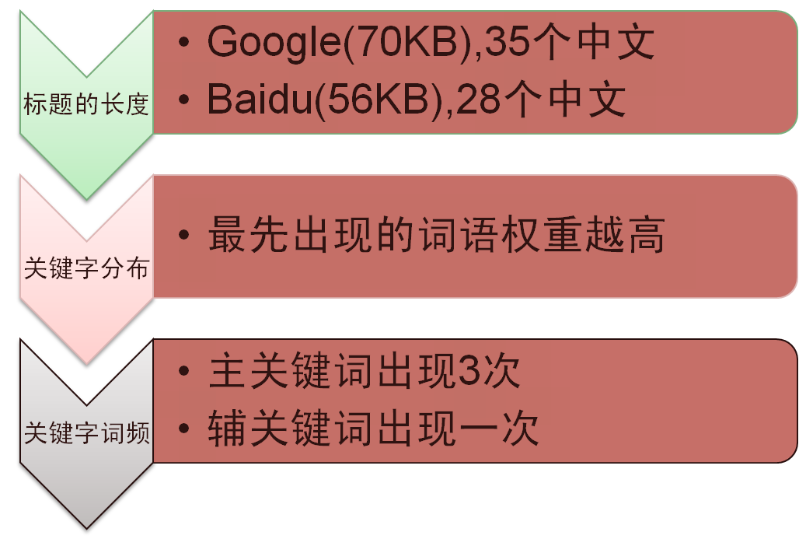

> 第01阶段.WEB基础：品优购-day01笔记-代码规范&品优购项目准备工作&首页初步


# 学习目标

* 能会引入ico图标
* 能简单看懂网站优化的三大标签
* **能使用字体图标 ( 重点 )** 
* 能说出我们css属性书写顺序 
* 能跟上pink老师的节奏完成品优购项目

# 一、代码规范（重点）

## 1. 概述

欢迎使用品优购代码规范， **这是借鉴京东WEB前端的代码规范**，组织的品优购内部规范。**旨在增强团队开发协作、提高代码质量和打造开发基石的编码规范**。

以下规范是团队基本约定的内容，**必须严格遵循**。

### 1) HTML规范

基于 [W3C](http://www.w3.org/)、[苹果开发者](https://developer.apple.com/) 等官方文档，并结合团队业务和开发过程中总结的规范约定，让页面HTML代码更具语义性。

### 2) 图片规范

了解各种图片格式特性，根据特性制定图片规范，包括但不限于图片的质量约定、图片引入方式、图片合并处理等，旨在从图片层面优化页面性能。

### 3) CSS规范

统一规范团队 CSS 代码书写风格和使用 CSS 预编译语言语法风格，提供常用媒体查询语句和浏览器私有属性引用，并从业务层面统一规范常用模块的引用。

### 4) 命名规范

从 `目录`、`图片`、`HTML/CSS文件`、`ClassName` 的命名等层面约定规范团队的命名习惯，增强团队代码的可读性。

## 2. HTML 规范

### 1) DOCTYPE 声明

HTML文件必须加上 DOCTYPE 声明，并统一使用 HTML5 的文档声明：

```html
<!DOCTYPE html>
```

**HTML5标准模版**

```html
<!DOCTYPE html>
  <html lang="zh-CN">
  <head>
  <meta charset="UTF-8">
  <title>HTML5标准模版</title>
  </head>
  <body>

  </body>
</html>
```

### 2) 页面语言lang

推荐使用属性值 `cmn-Hans-CN`（简体, 中国大陆），但是考虑浏览器和操作系统的兼容性，目前仍然使用 `zh-CN` 属性值

```
<html lang="zh-CN">
```

更多地区语言参考：

```
zh-SG 中文 (简体, 新加坡)   对应 cmn-Hans-SG 普通话 (简体, 新加坡)
zh-HK 中文 (繁体, 香港)     对应 cmn-Hant-HK 普通话 (繁体, 香港)
zh-MO 中文 (繁体, 澳门)     对应 cmn-Hant-MO 普通话 (繁体, 澳门)
zh-TW 中文 (繁体, 台湾)     对应 cmn-Hant-TW 普通话 (繁体, 台湾)
```

### 3) charset 字符集合

一般情况下统一使用 “UTF-8” 编码

```
<meta charset="UTF-8">
```

由于历史原因，有些业务可能会使用 “GBK” 编码

```
<meta charset="GBK">
```

请尽量统一写成标准的 “UTF-8”，不要写成 “utf-8” 或 “utf8” 或 “UTF8”。根据 [IETF对UTF-8的定义](http://www.ietf.org/rfc/rfc3629)，其编码标准的写法是 “UTF-8”；而 UTF8 或 utf8 的写法只是出现在某些编程系统中，如 .NET framework 的类 System.Text.Encoding 中的一个属性名就叫 UTF8。

### 4) 书写风格

#### HTML代码大小写

HTML标签名、类名、标签属性和大部分属性值统一用小写

*推荐：*

```
<div class="demo"></div>
```

*不推荐：*

```
<div class="DEMO"></div>
	
<DIV CLASS="DEMO"></DIV>
```

### 5) 类型属性

不需要为 CSS、JS 指定类型属性，HTML5 中默认已包含

*推荐：*

```
<link rel="stylesheet" href="" >
<script src=""></script>
```

*不推荐：*

```
<link rel="stylesheet" type="text/css" href="" >
<script type="text/javascript" src="" ></script>
```

### 6) 元素属性

- 元素属性值使用双引号语法
- 元素属性值可以写上的都写上

*推荐：*

```
<input type="text">
<input type="radio" name="name" checked="checked" >
```

*不推荐：*

```
<input type=text>	
<input type='text'>
<input type="radio" name="name" checked >
```

### 7) 特殊字符引用

文本可以和字符引用混合出现。这种方法可以用来转义在文本中不能合法出现的字符。

在 HTML 中不能使用小于号 “<” 和大于号 “>”特殊字符，浏览器会将它们作为标签解析，若要正确显示，在 HTML 源代码中使用字符实体

*推荐：*

```
<a href="#">more&gt;&gt;</a>
```

*不推荐：*

```
<a href="#">more>></a>
```

### 8) 代码缩进

统一使用四个空格进行代码缩进，使得各编辑器表现一致（各编辑器有相关配置）

```
<div class="jdc">
    <a href="#"></a>
</div>
```

### 9) 代码嵌套

元素嵌套规范，每个块状元素独立一行，内联元素可选

*推荐：*

```
<div>
    <h1></h1>
    <p></p>
</div>	
<p><span></span><span></span></p>
```

*不推荐：*

```
<div>
    <h1></h1><p></p>
</div>	
<p> 
    <span></span>
    <span></span>
</p>
```

段落元素与标题元素只能嵌套内联元素

*推荐：*

```
<h1><span></span></h1>
<p><span></span><span></span></p>
```

*不推荐：*

```
<h1><div></div></h1>
<p><div></div><div></div></p>
```

## 3. 图片规范

### 1) 内容图

内容图多以商品图等照片类图片形式存在，颜色较为丰富，文件体积较大

- 优先考虑 JPEG 格式，条件允许的话优先考虑 WebP 格式
- 尽量不使用PNG格式，PNG8 色位太低，PNG24 压缩率低，文件体积大
- **PC平台单张的图片的大小不应大于 200KB。**

### 2) 背景图

背景图多为图标等颜色比较简单、文件体积不大、起修饰作用的图片

- PNG 与 GIF 格式，优先考虑使用 PNG 格式,PNG格式允许更多的颜色并提供更好的压缩率
- 图像颜色比较简单的，如纯色块线条图标，优先考虑使用 PNG8 格式，避免不使用 JPEG 格式
- 图像颜色丰富而且图片文件不太大的（40KB 以下）或有半透明效果的优先考虑 PNG24 格式
- 图像颜色丰富而且文件比较大的（40KB - 200KB）优先考虑 JPEG 格式
- 条件允许的，优先考虑 WebP 代替 PNG 和 JPEG 格式

## 4. CSS规范

### 1) 代码格式化

样式书写一般有两种：一种是紧凑格式 (Compact)

```
.jdc{ display: block;width: 50px;}
```

一种是展开格式（Expanded）

```
.jdc {
    display: block;
    width: 50px;
}
```

**团队约定**

统一使用展开格式书写样式

### 2) 代码大小写

样式选择器，属性名，属性值关键字全部使用小写字母书写，属性字符串允许使用大小写。

```
/* 推荐 */
.jdc{
	display:block;
}
	
/* 不推荐 */
.JDC{
	DISPLAY:BLOCK;
}
```

### 3) 选择器

- 尽量少用通用选择器 `*`
- 不使用 ID 选择器
- 不使用无具体语义定义的标签选择器

```css
/* 推荐 */
.jdc {}
.jdc li {}
.jdc li p{}

/* 不推荐 */
*{}
#jdc {}
.jdc div{}
```

### 4) 代码缩进

统一使用四个空格进行代码缩进，使得各编辑器表现一致（各编辑器有相关配置）

```
.jdc {
    width: 100%;
    height: 100%;
}
```

### 5) 分号

每个属性声明末尾都要加分号；

```
.jdc {
    width: 100%;
    height: 100%;
}
```

### 6) 代码易读性

左括号与类名之间一个空格，冒号与属性值之间一个空格

*推荐：*

```
.jdc { 
    width: 100%; 
}
```

*不推荐：*

```
.jdc{ 
    width:100%;
}
```

逗号分隔的取值，逗号之后一个空格

*推荐：*

```
.jdc {
    box-shadow: 1px 1px 1px #333, 2px 2px 2px #ccc;
}
```

*不推荐：*

```
.jdc {
    box-shadow: 1px 1px 1px #333,2px 2px 2px #ccc;
}
```

为单个css选择器或新申明开启新行

*推荐：*

```css
.jdc, 
.jdc_logo, 
.jdc_hd {
    color: #ff0;
}
.nav{
    color: #fff;
}
```

*不推荐：*

```css
.jdc,jdc_logo,.jdc_hd {
    color: #ff0;
}.nav{
    color: #fff;
}
```

颜色值 `rgb()` `rgba()` `hsl()` `hsla()` `rect()` 中不需有空格，且取值不要带有不必要的 0

*推荐：*

```
.jdc {
    color: rgba(255,255,255,.5);
}

```

*不推荐：*

```
.jdc {
    color: rgba( 255, 255, 255, 0.5 );
}

```

属性值十六进制数值能用简写的尽量用简写

*推荐：*

```
.jdc {
    color: #fff;
}

```

*不推荐：*

```css
.jdc {
    color: #ffffff;
}
```

不要为 `0` 指明单位

*推荐：*

```css
.jdc {
    margin: 0 10px;
}
```

*不推荐：*

```css
.jdc {
    margin: 0px 10px;
}
```

### 7) 属性值引号

css属性值需要用到引号时，统一使用单引号

```css
/* 推荐 */
.jdc { 
	font-family: 'Hiragino Sans GB';
}

/* 不推荐 */
.jdc { 
	font-family: "Hiragino Sans GB";
}
```

### 8) 属性书写顺序（重点）

**建议遵循以下顺序：**

1. **布局定位属性**：display / position / float / clear / visibility / overflow（建议 display 第一个写，毕竟关系到模式）
2. **自身属性**：width / height / margin / padding / border / background
3. **文本属性**：color / font / text-decoration / text-align / vertical-align / white- space / break-word
4. **其他属性（CSS3）**：content / cursor / border-radius / box-shadow / text-shadow / background:linear-gradient …

```css
.jdc {
    display: block;
    position: relative;
    float: left;
    width: 100px;
    height: 100px;
    margin: 0 10px;
    padding: 20px 0;
    font-family: Arial, 'Helvetica Neue', Helvetica, sans-serif;
    color: #333;
    background: rgba(0,0,0,.5);
    -webkit-border-radius: 10px;
    -moz-border-radius: 10px;
    -o-border-radius: 10px;
    -ms-border-radius: 10px;
    border-radius: 10px;
}
```

[mozilla官方属性顺序推荐](https://www.mozilla.org/css/base/content.css)

## 5. 命名规范（重点）

由历史原因及个人习惯引起的 DOM 结构、命名不统一，导致不同成员在维护同一页面时，效率低下，迭代、维护成本极高。

### 1) 目录命名

- 项目文件夹：pinyougou
- 样式文件夹：css
- 脚本文件夹：js
- 样式类图片文件夹：img
- 产品类图片文件夹： upload
- 字体类文件夹： fonts

### 2) ClassName命名

ClassName的命名应该尽量精短、明确，必须以**字母开头命名**，且**全部字母为小写**，单词之间**统一使用下划线** “_” 连接

.nav_top

#### 常用命名推荐

**注意**：ad、banner、gg、guanggao 等有机会和广告挂勾的字眠不建议直接用来做ClassName，因为有些浏览器插件（Chrome的广告拦截插件等）会直接过滤这些类名，因此

```
<div class="ad"></div>

```

这种广告的英文或拼音类名不应该出现

另外，**敏感不和谐字眼**也不应该出现，如：

```
<div class="fuck"></div>
<div class="jer"></div>
<div class="sm"></div>
<div class="gcd"></div> 
<div class="ass"></div> 
<div class="KMT"></div> 
...

```

| ClassName              | 含义                   |
| ---------------------- | -------------------- |
| about                  | 关于                   |
| account                | 账户                   |
| arrow                  | 箭头图标                 |
| article                | 文章                   |
| aside                  | 边栏                   |
| audio                  | 音频                   |
| avatar                 | 头像                   |
| bg,background          | 背景                   |
| bar                    | 栏（工具类）               |
| branding               | 品牌化                  |
| crumb,breadcrumbs      | 面包屑                  |
| btn,button             | 按钮                   |
| caption                | 标题，说明                |
| category               | 分类                   |
| chart                  | 图表                   |
| clearfix               | 清除浮动                 |
| close                  | 关闭                   |
| col,column             | 列                    |
| comment                | 评论                   |
| community              | 社区                   |
| container              | 容器                   |
| content                | 内容                   |
| copyright              | 版权                   |
| current                | 当前态，选中态              |
| default                | 默认                   |
| description            | 描述                   |
| details                | 细节                   |
| disabled               | 不可用                  |
| entry                  | 文章，博文                |
| error                  | 错误                   |
| even                   | 偶数，常用于多行列表或表格中       |
| fail                   | 失败（提示）               |
| feature                | 专题                   |
| fewer                  | 收起                   |
| field                  | 用于表单的输入区域            |
| figure                 | 图                    |
| filter                 | 筛选                   |
| first                  | 第一个，常用于列表中           |
| footer                 | 页脚                   |
| forum                  | 论坛                   |
| gallery                | 画廊                   |
| group                  | 模块，清除浮动              |
| header                 | 页头                   |
| help                   | 帮助                   |
| hide                   | 隐藏                   |
| hightlight             | 高亮                   |
| home                   | 主页                   |
| icon                   | 图标                   |
| info,information       | 信息                   |
| last                   | 最后一个，常用于列表中          |
| links                  | 链接                   |
| login                  | 登录                   |
| logout                 | 退出                   |
| logo                   | 标志                   |
| main                   | 主体                   |
| menu                   | 菜单                   |
| meta                   | 作者、更新时间等信息栏，一般位于标题之下 |
| module                 | 模块                   |
| more                   | 更多（展开）               |
| msg,message            | 消息                   |
| nav,navigation         | 导航                   |
| next                   | 下一页                  |
| nub                    | 小块                   |
| odd                    | 奇数，常用于多行列表或表格中       |
| off                    | 鼠标离开                 |
| on                     | 鼠标移过                 |
| output                 | 输出                   |
| pagination             | 分页                   |
| pop,popup              | 弹窗                   |
| preview                | 预览                   |
| previous               | 上一页                  |
| primary                | 主要                   |
| progress               | 进度条                  |
| promotion              | 促销                   |
| rcommd,recommendations | 推荐                   |
| reg,register           | 注册                   |
| save                   | 保存                   |
| search                 | 搜索                   |
| secondary              | 次要                   |
| section                | 区块                   |
| selected               | 已选                   |
| share                  | 分享                   |
| show                   | 显示                   |
| sidebar                | 边栏，侧栏                |
| slide                  | 幻灯片，图片切换             |
| sort                   | 排序                   |
| sub                    | 次级的，子级的              |
| submit                 | 提交                   |
| subscribe              | 订阅                   |
| subtitle               | 副标题                  |
| success                | 成功（提示）               |
| summary                | 摘要                   |
| tab                    | 标签页                  |
| table                  | 表格                   |
| txt,text               | 文本                   |
| thumbnail              | 缩略图                  |
| time                   | 时间                   |
| tips                   | 提示                   |
| title                  | 标题                   |
| video                  | 视频                   |
| wrap                   | 容器，包，一般用于最外层         |
| wrapper                | 容器，包，一般用于最外层         |


# 二、品优购项目（一）

## 1. 品优购项目介绍

项目名称：品优购
项目描述：品优购是一个电商网站，我们要完成首页、列表页、详情页制作


## 2. 项目背景

现阶段电商类网站很流行，很多同学毕业之后会进入电商类企业工作，同时电商类网站需要的技术也是较为复杂的，

* 复习、总结、提高前面所学布局技术。

## 3. 设计目标

- 保证浏览器 ie7及以上, 火狐, 360, safari，chrome等。谁让我再测ie6，就跟谁急。。
- 熟悉CSS+DIV布局，页面的搭建工作
- 了解常用电商类网站的布局模式
- 为后期品优购移动端做铺垫

## 4. 几点思考

(1). 开发工具  sublime  、photoshop（fw）、主流浏览器（以chrome浏览器为主）

(2). 技术栈

```
HTML 结构 + CSS  布局 (因为我们就会这些。。。嘻嘻)
```

## 5. 代码规范

请参照品优购代码规范

## 6. 前期准备工作

要实现结构和样式相分离的设计思想。

### 1) 目录文件夹 

| 名称       | 说明        |
| -------- | --------- |
| 项目文件夹    | pinyougou |
| 样式类图片文件夹 | img       |
| 样式文件夹    | css       |
| 产品类图片文件夹 | upload    |
| 字体类文件夹   | fonts     |
| 脚本文件夹    | js        |

### 2) 样式文件的分类

* 初始化css (css reset)  让浏览器风格统一，把常用的初始化语句放入 base.css里面。


* 我们把一些公共的样式 放入common.css里面。

  

## 7. 网站ico图标（新知识点）

  

### 1) 使用ico图标

* 首先把favicon.ico 这个图标放到**根目录**下。

* 再html里面，  head 之间 引入 代码。

  ```html
  <link rel="shortcut icon" href="favicon.ico"  type="image/x-icon"/>     
  ```

  

### 2) 制作ico图标

我们可以自己做的图片，转换为 ico图标，以便放到我们站点里面。

方法步骤：

* 首先把我们想要的切成图片。
* 要把图片转换为 ico 图标，**我们借助于第三方转换网站：   http://www.bitbug.net/**。  比特虫

总结：

```
<link rel="shortcut icon" href="favicon.ico"  type="image/x-icon"/>       
```

注意： 

1. 她（它）是显示在浏览器中的网页图标。
2. 它是图标形式，不是一个图片
3. 位置是放到 head 标签中间。
4. 后面的type="image/x-icon"  属性可以省略。（我相信你也愿意省略。）
5. 为了兼容性，请将favicon.ico 这个图标放到根目录下。（我们就不要任性了，听话放位置，省很多麻烦。。你好，我也好。


## 8. 网站优化三大内容（新知识点）

SEO是由英文Search Engine Optimization缩写而来， 中文意译为“搜索引擎优化”！

常见的搜索引擎，比如百度，谷歌，雅虎，搜狗等等..

SEO是指通过对网站进行站内优化、网站结构调整、网站内容建设、网站代码优化等)和站外优化，从而提高网站的关键词排名以及公司产品的曝光度。 简单的说就是，把产品做好，搜索引擎就会介绍客户来。  

 我们现在阶段主要进行站内优化。网站优化，我们应该要懂。。。


### 1) 网页title 标题

title具有不可替代性，是我们的内页第一个重要标签，是搜索引擎了解网页的入口，和对网页主题归属的最佳判断点。



建议：

首页标题：**网站名（产品名）- 网站的介绍**    

例如：

```html
<title>品优购-综合网购首选-正品低价、品质保障、配送及时、轻松购物！</title>
```

小米商城 - 小米5s、红米Note 4、小米MIX、小米笔记本官方网站

### 2) Description  网站说明

对于关键词的作用明显降低，但由于很多搜索引擎，仍然大量采用网页的MATA标签中描述部分作为搜索结果的“内容摘要”。 就是简要说明我们网站的主要做什么的。
我们提倡，Description作为网站的总体业务和主题概括，多采用“我们是…”“我们提供…”“×××网作为…”“电话：010…”之类语句。

品优购网：

```html
<meta name="description" content="品优购JD.COM-专业的综合网上购物商城,销售家电、数码通讯、电脑、家居百货、服装服饰、母婴、图书、食品等数万个品牌优质商品.便捷、诚信的服务，为您提供愉悦的网上购物体验!" />
```

注意点：

1. 描述中出现关键词，与正文内容相关，这部分内容是给人看的，所以要写的很详细，让人感兴趣， 吸引用户点击。
2. 同样遵循简短原则，字符数含空格在内不要超过 120  个汉字。
3. 补充在 title  和 keywords  中未能充分表述的说明.
4. **用英文逗号** 关键词1,关键词2

```html
<meta name="description" content="小米商城直营小米公司旗下所有产品，囊括小米手机系列小米MIX、小米Note 2，红米手机系列红米Note 4、红米4，智能硬件，配件及小米生活周边，同时提供小米客户服务及售后支持。" />
```

### 3) Keywords 关键字

Keywords是页面关键词，是搜索引擎关注点之一。Keywords应该限制在**6～8个关键词左右**，**电商类网站可以多 少许**。

品优购网：

```html
<meta name="Keywords" content="网上购物,网上商城,手机,笔记本,电脑,MP3,CD,VCD,DV,相机,数码,配件,手表,存储卡,品优购" />
```

小米网：

```html
<meta name="keywords" content="小米,小米6,红米Note4,小米MIX,小米商城" />
```

###  4) 总结

1. 我们的网页要做的优秀，符合搜索引擎的要求，才可以让搜索引擎优先显示我们的网页。  

所以我们的网站要做很多的优化， 其中就有这三大标签。

2. 一般情况下，三大标签里面的优化词，都是专门的优化人员写的，我们大概了解一下规范就可以了。
3. 我们的主要任务是，能写出这三大标签， 然后把优化人员给我们的内容，添加到里面。


## 9. 字体图标 ( 重点，新知识点) 

图片是有诸多优点的，但是缺点很明显，比如图片不但增加了总文件的大小，还增加了很多额外的"http请求"，这都会大大降低网页的性能的。更重要的是图片不能很好的进行“缩放”，因为图片放大和缩小会失真。 我们后面会学习移动端响应式，很多情况下希望我们的图标是可以缩放的。此时，一个非常重要的技术出现了，额不是出现了，是以前就有，是被从新"宠幸"啦。。 这就是字体图标（iconfont).

###  1) 字体图标优点

```
可以做出跟图片一样可以做的事情,改变透明度、旋转度，等..
但是本质其实是文字，可以很随意的改变颜色、产生阴影、透明效果等等...
本身体积更小，但携带的信息并没有削减。
几乎支持所有的浏览器
移动端设备必备良药...
```

### 2) 字体图标使用流程

总体来说，字体图标按照如下流程：


### 3) 设计字体图标

假如图标是我们公司单独设计，那就需要第一步了，这个属于UI设计人员的工作， 他们在 illustrator 或 Sketch 这类矢量图形软件里创建 icon图标， 比如下图：


  之后保存为svg格式，然后给我们前端人员就好了。 

  其实第一步，我们不需要关心，只需要给我们这些图标就可以了，如果图标是大众的，网上本来就有的，可以直接跳过第一步，进入第三步。

### 4) 上传生成字体包

   当UI设计人员给我们svg文件的时候，我们需要转换成我们页面能使用的字体文件， 而且需要生成的是兼容性的适合各个浏览器的。

​    **推荐网站： http://icomoon.io**

* icomoon字库

IcoMoon成立于2011年，推出的第一个自定义图标字体生成器，它允许用户选择他们所需要的图标，使它们成一字型。 内容种类繁多，非常全面，唯一的遗憾是国外服务器，打开网速较慢。

* 阿里icon font字库

http://www.iconfont.cn/

这个是阿里妈妈M2UX的一个icon font字体图标字库，包含了淘宝图标库和阿里妈妈图标库。可以使用AI制作图标上传生成。 一个字，免费，免费！！

### 5) 下载兼容字体包

刚才上传完毕， 网站会给我们把UI做的svg图片转换为我们的字体格式， 然后下载下来就好了

当然，我们不需要自己专门的图标，是想网上找几个图标使用，以上2步可以直接省略了， 直接到刚才的网站上找喜欢的下载使用吧。


### 6) 字体引入到HTML

得到压缩包之后，我们得知字体图标 本质就是 字体文件。 注意这个压缩包不要删掉，我们后面还有用的。


最后一步，是最重要的一步了， 就是字体文件已经有了，我们需要引入到我们页面中。

1. 首先把 fonts文件夹放入我们 根目录下 。

   

   ##### 2. html标签内里面添加结构

    

   ```css
    <span></span>  
   ```

   ##### 3. 在样式里面声明字体： 告诉别人我们自己定义的字体(一定注意字体文件路径的问题)

   ```css
   @font-face {
     font-family: 'icomoon';
     src:  url('fonts/icomoon.eot?7kkyc2');
     src:  url('fonts/icomoon.eot?7kkyc2#iefix') format('embedded-opentype'),
       url('fonts/icomoon.ttf?7kkyc2') format('truetype'),
       url('fonts/icomoon.woff?7kkyc2') format('woff'),
       url('fonts/icomoon.svg?7kkyc2#icomoon') format('svg');
     font-weight: normal;
     font-style: normal;
   }
   ```

   ##### 4. 给盒子使用字体

   ```css
   span {
   		font-family: "icomoon";
   	}
   ```

### 7) 追加字体图标

   如果工作中，原来的字体图标不够用了，我们需要添加新的字体图标，但是原来的不能删除，继续使用，此时我们需要这样做

   **把压缩包里面的selection.json 从新上传**，然后，选中自己想要新的图标，从新下载压缩包，替换原来文件即可。

   

### @拓展 常见字体格式（了解）

**不同浏览器所支持的字体格式是不一样的**，我们有必要了解一下有关字体格式的知识。

1. TureType(.ttf)格式

.ttf字体是Windows和Mac的最常见的字体，是一种RAW格式，支持这种字体的浏览器有IE9+、Firefox3.5+、Chrome4+、Safari3+、Opera10+、iOS Mobile、Safari4.2+；

1. OpenType(.otf)格式

.otf字体被认为是一种原始的字体格式，其内置在TureType的基础上，支持这种字体的浏览器有Firefox3.5+、Chrome4.0+、Safari3.1+、Opera10.0+、iOS Mobile、Safari4.2+；

1. Web Open Font Format(.woff)格式

woff字体是Web字体中最佳格式，他是一个开放的TrueType/OpenType的压缩版本，同时也支持元数据包的分离，支持这种字体的浏览器有IE9+、Firefox3.5+、Chrome6+、Safari3.6+、Opera11.1+；

1. Embedded Open Type(.eot)格式

.eot字体是IE专用字体，可以从TrueType创建此格式字体，支持这种字体的浏览器有IE4+；

1. SVG(.svg)格式

.svg字体是基于SVG字体渲染的一种格式，支持这种字体的浏览器有Chrome4+、Safari3.1+、Opera10.0+、iOS Mobile Safari3.2+；

了解了上面的知识后，我们就**需要为不同的浏览器准备不同格式的字体**，通常我们会通过字体生成工具帮我们生成各种格式的字体，因此**无需过于在意字体格式间的区别差异**。

##  10. 品优购首页布局

**命名集合：**

| 名称    | 说明                     |
| ----- | ---------------------- |
| 快捷导航栏 | shortcut               |
| 头部    | header                 |
| 标志    | logo                   |
| 购物车   | shopcar                |
| 搜索    | search                 |
| 热点词   | hotwords               |
| 导航    | nav                    |
| 导航左侧  | dropdown  包含  .dd  .dt |
| 导航右侧  | navitems               |

### 1) shortcut 制作

shortcut的盒子是通栏的，设置浅灰色的背景，然后套着版心的盒子 w，控制宽度和居中问题；


放大一点：


* 通栏的盒子  命名为**shortcut** **快捷导航**的意思， 注意，这里给行高，可以继承给里面的子盒子。
* 里面包含 版心的盒子 **w**
* 版心盒子里面包含1号左侧盒子左浮动
* 版心盒子里面包含2号右侧盒子右浮动

### 2) header 制作


* header盒子必须要有高度
* 1号盒子是 logo 标志  定位
* 2号盒子是 search 搜索模块 定位
* 3号盒子是 hotwords  热词模块 定位
* 4号盒子是 shopcar 购车车模块
  * count 统计部分  用绝对定位做
  * count 统计部分  不要给宽度，因为可能买的件数比较多，让件数撑开就好了 给一个高度
  * 一定注意左下角 不是圆角 其余三个是圆角

### 3) nav 制作


* nav 盒子通栏有高度   而且有个下边框
* 1号盒子 左侧浮动 dorpdown  下拉导航  里面包含 dt   dd 
* 2号盒子右侧浮动  navitems 导航栏组

## 11. logo 优化

* logo  里面 首先放一个 **h1 标签 ，目的是为了提权**，告诉搜索引擎，这个地方很重要
* h1里面在放一个链接，可以返回首页的，   **给链接一个 大小 和  logo 的背景图片**
* 链接里面要放文字（网站名称），为了搜索引擎收录我们。  但是**文字不要显示出来**
  *  要用 text-indent  移到盒子外面 （text-indent: -9999px)   然后overflow:hidden  淘宝的做法
  *  **直接给font-size: 0;  就看不到文字了，  京东的做法。**
* 最后给 **a链接设置一个属性title**（这个属性的作用，就是当鼠标悬停在超链接上面的时候，给出提示信息）  这样鼠标放到logo 上，  就可以看到提示文字了


