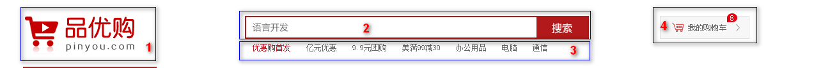

> 第01阶段.WEB基础：品优购-day02笔记-品优购首页

# 学习目标

* 能跟上老师的节奏，完成品优购项目的首页 index.html

  

#  品优购项目(二)

##  1. 品优购首页布局

命名集合：

| 名称       | 说明                     |
| -------- | ---------------------- |
| 快捷导航栏    | shortcut               |
| 头部       | header                 |
| 标志       | logo                   |
| 购物车      | shopcar                |
| 搜索       | search                 |
| 热点词      | hotwords               |
| 导航       | nav                    |
| 导航左侧     | dorpdown  包含  .dd  .dt |
| 导航右侧     | navitems               |
| 页面底部     | footer                 |
| 页面底部服务模块 | mod_service            |
| 页面底部帮助模块 | mod_help               |
| 页面底部版权模块 | mod_copyright          |

### 1) shortcut **快捷导航**栏（上次已讲）

- 通栏的盒子  命名为**shortcut** **快捷导航**的意思， 注意，这里给行高，可以继承给里面的子盒子。
- 里面包含 版心的盒子
- 版心盒子里面包含1号左侧盒子左浮动
- 版心盒子里面包含2号右侧盒子右浮动

### 2) header 头部 （上次已讲）

- header盒子必须要有高度
- 1号盒子是 logo 标志  定位
- 2号盒子是 search 搜索模块 定位
- 3号盒子是 hotwords  热词模块 定位
- 4号盒子是 shopcar 购车车模块
  - count 统计部分  用绝对定位做
  - count 统计部分  不要给宽度，因为可能买的件数比较多，让件数撑开就好了 给一个高度
  - 一定注意左下角 不是圆角 其余三个是圆角

### 3) nav 导航栏制作

- nav 盒子通栏有高度   而且有个下边框
  - 1号盒子 左侧浮动  dropdown下拉导航  里面包含 dt   dd 
- 2号盒子右侧浮动  navitems 导航栏组

 

### 4) footer 底部

* footer 页面底部盒子  通栏 给一个高度  灰色的背景
* footer 里面 首先一个 大 的版心
* 版心里面包含 1号盒子  **mod_service**     服务模块     module  模块的意思
* 版心里面包含 2号盒子 **mod_help**   帮助模块
* 版心里面包含 3号盒子 **mod_copyright**   版权模块 

#### a. mod_service  服务模块制作

使用 **切片选择工具** ，可以**竖着**划分为5列，5个li   li的宽度240px

### 5) main  网页主体模块

main  网页主体模块，这部分是 首页index.html页面 里面 专有的， 

**注意 需要新的样式文件**  **index.css**  

* **main** 盒子 宽度 为  980像素， 距离 左边 219px  ，给main盒子一个margin-left 就好了， 给高度就不用清除浮动。

* main 里面包含 左侧盒子 左浮动  **focus  焦点图** 模块 

* main 里面包含 右侧盒子 右浮动  **newsflash  新闻快报模块** 

  

#### a. main中的：焦点图 focus

#### b. main中的：新闻快报 newsflash

* 1 号盒子 为 news 新闻模块  
* 2 号盒子 为lifeservice  生活服务模块
* 3 号盒子为 bargain  特价商品

##### 新闻快报 newsflash中的一号盒子：news 新闻模块

* 注意，这里我们 分为 上下两个模块，  但是 两个模块 都用div   
* 1号 盒子    news-hd   新闻头部模块  给一个 高度 和   下边框   
* 2号 盒子    news-bd   新闻主题部分   里面 包含 ul 和  li  还有 链接 

##### 新闻快报 newsflash中的二号盒子：lifeservice  生活服务模块

此地方有个小技巧，

* lifeservice  盒子 宽度为   250   但是装不开  里面的 4个 小 li 
* 可以让  lifeservice    里面的 ul  宽度为 252  就可以 装的下  4个 小li
* lifeservice  盒子  overflow 隐藏多余的部分就可以了。

### 6) recommend  推荐模块

* 里面包含2个盒子， 浮动即可
* 1号盒子    recom-hd   
* 2号盒子    recom-bd  注意里面的小 竖线   

