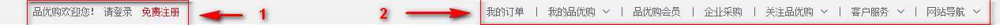
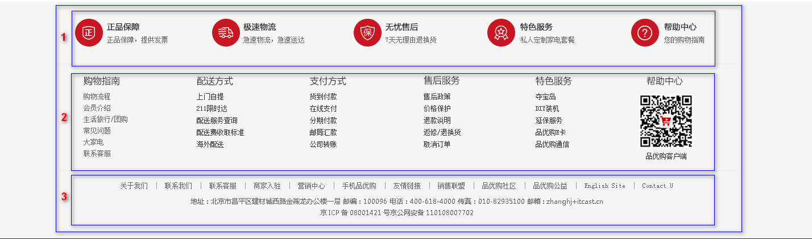
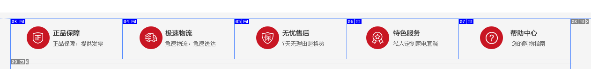
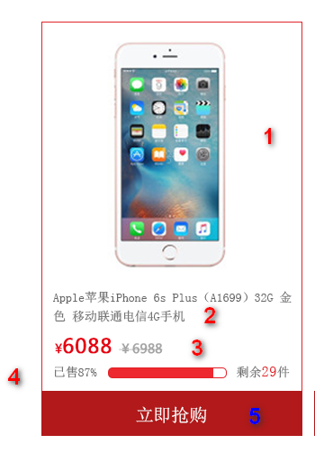

> 第01阶段.WEB基础：品优购-day03笔记-完善品优购的首页&制作列表页


# 学习目标

- 完善 品优购项目的首页 index.html
- 制作 品优购项目的列表页 list.html


# 品优购项目(三)

> 第01阶段.WEB基础：品优购-day02笔记-品优购首页


## 1. 品优购首页布局

命名集合：	

| 名称       | 说明                     |
| -------- | ---------------------- |
| 快捷导航栏    | shortcut               |
| 头部       | header                 |
| 标志       | logo                   |
| 购物车      | shopcar                |
| 搜索       | search                 |
| 热点词      | hotwords               |
| 导航       | nav                    |
| 导航左侧     | dropdown  包含  .dd  .dt |
| 导航右侧     | navitems               |
| 页面底部     | footer                 |
| 页面底部服务模块 | mod_service            |
| 页面底部帮助模块 | mod_help               |
| 页面底部版权模块 | mod_copyright          |

### 1) shortcut **快捷导航**栏（上次已讲）



- 通栏的盒子  命名为**shortcut** **快捷导航**的意思， 注意，这里给行高，可以继承给里面的子盒子。
- 里面包含 版心的盒子
- 版心盒子里面包含1号左侧盒子左浮动
- 版心盒子里面包含2号右侧盒子右浮动

### 2) header 头部 （上次已讲）


- header盒子必须要有高度
- 1号盒子是 logo 标志  定位
- 2号盒子是 search 搜索模块 定位
- 3号盒子是 hotwords  热词模块 定位
- 4号盒子是 shopcar 购车车模块
  - count 统计部分  用绝对定位做
  - count 统计部分  不要给宽度，因为可能买的件数比较多，让件数撑开就好了 给一个高度
  - 一定注意左下角 不是圆角 其余三个是圆角

### 3) nav 导航栏制作


- nav 盒子通栏有高度   而且有个下边框
- 1号盒子 左侧浮动 dropdown  下拉导航  里面包含 dt   dd 
- 2号盒子右侧浮动  navitems 导航栏组

 

### 4) footer 底部



- footer 页面底部盒子  通栏 给一个高度  灰色的背景
- footer 里面 首先一个 大 的版心
- 版心里面包含 1号盒子  mod_service     服务模块     module  模块的意思
- 版心里面包含 2号盒子 mod_help   帮助模块
- 版心里面包含 3号盒子 mod_copyright   版权模块 

#### a. mod_service  服务模块制作




### 5) main  网页主体模块

main  网页主体模块，这部分是 首页index.html页面 里面 专有的， 

**注意 需要新的样式文件**  **index.css**  


- **main** 盒子 宽度 为  980像素， 距离 左边 220  给一个margin-left 就好了， 给高度就不用清除浮动。

- main 里面包含 左侧盒子 左浮动  **focus  焦点图** 模块 

- main 里面包含 右侧盒子 右浮动  **newsflash  新闻快报模块** 

  

#### a. main中的：焦点图 focus


#### b. main中的：新闻快报 newsflash


- 1 号盒子 为 news 新闻模块  
- 2 号盒子 为lifeservice  生活服务模块
- 3 号盒子为 bargain  特价商品

##### 新闻快报 newsflash中的一号盒子：news 新闻模块


- 注意，这里我们 分为 上下两个模块，  但是 两个模块 都用div   
- 1号 盒子    news-hd   新闻头部模块  给一个 高度 和   下边框   
- 2号 盒子    news-bd   新闻主题部分   里面 包含 ul 和  li  还有 链接 

##### 新闻快报 newsflash中的二号盒子：lifeservice  生活服务模块


此地方有个小技巧，

- lifeservice  盒子 宽度为   250   但是装不开  里面的 4个 小 li 
- 可以让  lifeservice    里面的 ul  宽度为 252  就可以 装的下  4个 小li
- lifeservice  盒子  overflow 隐藏多余的部分就可以了。

### 6) recommend  推荐模块


- 里面包含2个盒子， 浮动即可
- 1号盒子    recom-hd   
- 2号盒子    recom-bd  注意里面的小 竖线   


### --------上面的之前我们已经布局完了----------

### 7) floor 楼层区 

**注意这个floor  一个大盒子** 包含， **不要给高度，内容有多少，算多少**


#### a. 家用电器模块：分析


* 在 **floor** 中，创建一个家电模块，类名  **.jiaodian** , 家电这个模块简单 不需要写样式，**引入**一个**版心 .w**  控制下宽度就可以了
* 版心居中对齐    因为家电、手机通讯这些模块  基本相同，下面的 模块基本用这些样式  所以 咱们下面两个盒子的命名是：
* 1号盒子  **box-hd**  给一个高度， 有个下边框      里面分为左右2个盒子
* 2号盒子  **box-bd**   不要给高度。

#### b. 家用电器模块：box-hd 模块

* 有高度


* 左边 h3  盒子     
* 右边 div   命名为 **tab-list**      因为用到 tab 切换效果， 所以 里面  要用 ul  和  li  来做 。

####  c. 家用电器模块：box-bd 模块


* **根据tab 切换的原理**，  应该还需要一个 **tab-content** 的 内容来包装 里面的 5个 盒子
* 分为5个大列  列的宽度 不一致 

### 8) fixedtool 侧边栏 

此模块用**固定定位**   里面包含  li   

 

## 2. 知识点 - 过渡(CSS3)

过渡（**transition**)是CSS3中具有颠覆性的特征之一，我们可以在不使用 Flash 动画或 JavaScript 的情况下，当元素从一种样式**渐渐地变**换为另一种样式时为元素添加效果。

**过渡动画：   是从一个状态 渐渐的过渡到另外一个状态**

 

语法格式:

```
transition: 要过渡的属性  花费时间  [运动曲线]  [何时开始];
```

| 属性                         | 描述                      | CSS  |
| -------------------------- | ----------------------- | ---- |
| transition                 | 简写属性，用于在一个属性中设置四个过渡属性。  | 3    |
| transition-property        | 规定应用过渡的 CSS 属性的名称。      | 3    |
| transition-duration        | 定义过渡效果花费的时间。默认是 0。      | 3    |
| transition-timing-function | 规定过渡效果的时间曲线。默认是 "ease"。 | 3    |
| transition-delay           | 规定过渡效果何时开始。默认是 0。       | 3    |

* 属性

​    属性就是你想要变化的 css 属性，  宽度高度 背景颜色 内外边距都可以 。如果想要所有的属性都变化过渡， 写一个all 就可以。

* 花费时间

  transition-duration  花费时间  单位是  秒（必须写单位）     s   ms      比如 0.5s    这个s单位必须写      ms 毫秒

* **运动曲线   默认是 ease**

运动曲线示意图：


* 何时开始 

    默认是 0s  鼠标触发就立即开始    可以设置 延迟触发时间


**案例：**

```css
div {
    width: 200px;
    height: 100px;
    background-color: pink;
    /* transition: 要过渡的属性  花费时间  运动曲线  何时开始; */
    transition: width 0.6s ease 0s, height 0.3s ease-in 1s;
    /* transtion 过渡的意思  这句话写到div里面而不是 hover里面 */
  
			
}
div:hover {  /* 鼠标经过盒子，我们的宽度变为400 */

    width: 600px;
    height: 300px;
}

transition: all 0.6s;  /* 所有属性都变化用all 就可以了  后面俩个属性可以省略 */
```

transition: all 0.5**s**;

常见效果：

  按钮变换底色     图片移动      小米效果 （阴影效果）   传智导航栏效果 等等


## 3. 列表页制作

### 列表页准备工作

* 列表页面是新的页面，我们需要新建 list.html    

* 因为 列表页的 头部 和 底部 基本一致， 我们需要 把首页中的 头部  和 底部的  结构复制过去

* 头部和底部的 样式 ，列表也需要， 因此 list.html  也需要 引入   common.css  

* 同时 需要**新的 list.css** 文件   这个 样式文件，里面只写  list.html  结构里面的内容就好了

  

### 1) 列表页 header 和  nav 修改 


* 秒杀盒子 sk  定位 即可  second  kill 
* 1 号 盒子 左侧浮动  sk_list   里面包含 ul  和  li 
* 2 号盒子  左侧浮动   sk_con  里面 包含 ul  和  li

### 2) 列表页 主体内容区 sk_container

这个盒子里面包含了 所有的 列表页的所有主体内容 

 

* 1号盒子 主体内容区 sk_container    **给宽度 1200px  不要给高度** 
* 2号盒子 主体内容区 头部  sk_hd   插入图片即可  
* 3号盒子 主体内容区 身体  sk_bd  里面包含 很多的 ul 和  li 

#### a. 列表页列表页 主体内容区  （sk_container）中的小模块：商品介绍模块 sk_goods  布局



* **此li 我们命名为 sk_goods**  
* 1号位置   有 a 包含 本图片 和下面的 标题    插入 图片即可   **seckill_mod_goods_img**  可以做一个 鼠标放入 图片 上滑动的效果
* 2号位置  标题  H5  命名为  **sk_goods_title**  
* 3号 位置 为 价格 div  命名为  **sk_goods_price**    
* 4号位置  为  div  命名为  **sk_goods_progress**    此处，我们 采取 代码的形式 写出 这个 进度条
* 5号位置  为 a  链接   命名为  **sk_goods_buy**   此处注意， 因为父盒子已经有左右padding   我们这里用定位合适。

#### b) 分页制作 page


* 最大的盒子  我们div  命名为  page   注意里面的盒子 全部用 行内块 
* **1号盒子 用 span**  命名为 **page_num ( 页码的意思 )**  里面 放 a      把a 转换为 行内块  设置样式 
  * pn_prev  上一页     pn_next  下一页
* **2号盒子 用 span** 命名为  **page_skip    ( skip 跳转 转移的意思 )**    里面注意 有 input  和  button  

## 4. 知识点 - 获得焦点元素

**:focus 伪类** 选择器用于**选取获得焦点的元素** 。 我们这里主要针对的是 **表单元素**

类似于  :hover 

语法：

~~~css

.total input {
  border: 1px solid #ccc;
  height: 30px;
  width: 40px;
  transition: all 0.5s;
}
/*这个input 获得了焦点*/
.total input:focus {
  width: 80px;
  border: 1px solid skyblue;
}
~~~

  border: 1px solid #ccc;
  height: 30px;
  width: 40px;
  transition: all .5s;
}
*这个input 获得了焦点*
.total input:focus {
  width: 80px;
  border: 1px solid skyblue;
}


